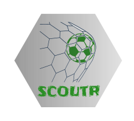

<!-- README.md is generated from README.Rmd. Please edit that file -->

```{r, include = FALSE}
knitr::opts_chunk$set(
  collapse = TRUE,
  comment = "#>",
  fig.path = "man/figures/README-",
  out.width = "100%"
)
options(tibble.print_min = 5, tibble.print_max = 5)
```

# scoutr <a href=''></a>

<!-- badges: start -->
[](https://www.tidyverse.org/lifecycle/#experimental)
[](https://github.com/shawnsanto/scoutr/actions)
<!-- badges: end -->

## Overview

A complete and consistent set of functions for reading, manipulating, and 
visualizing Wyscout soccer data in R.

All public Wyscout data is available at [https://figshare.com/collections/Soccer_match_event_dataset/4415000/2](https://figshare.com/collections/Soccer_match_event_dataset/4415000/2)

## Installation

The package is not available on CRAN, please install the development version.

```{r, eval = FALSE}
# install.packages("devtools")
devtools::install_github("shawnsanto/scoutr")
```

## Usage

```{r message = FALSE}
library(scoutr)
library(dplyr)

# read and preview some event data
path <- system.file("extdata", "events_england.json", package = "scoutr")
events <- fc_read_events(path)

events %>%
  select(event_sec:end_y)

# transform pitch locations and create sf object
events %>%
  select(event_sec:end_y) %>%
  fc_locations_transform(x = c("start_x", "end_x"), 
                         y = c("start_y", "end_y"),
                         dim = c(105, 70), units = "meters") %>% 
  fc_locations_link(start_loc = c("start_x", "start_y"), 
                    end_loc   = c("end_x", "end_y"))

# define possessions
events %>% 
  select(match_id, event_name, team_id) %>% 
  fc_sequence_possession(event_var = "event_name", team_var = "team_id") %>% 
  print(n = 20)

# compute velocities
events %>%
  select(-starts_with("tag_")) %>%
  fc_locations_transform(x = c("start_x", "end_x"), y = c("start_y", "end_y")) %>%
  fc_sequence_possession(event_var = "event_name", team_var = "team_id") %>%
  fc_velocity_event(start_loc = c("start_x", "start_y"), end_loc = c("end_x", "end_y")) %>%
  fc_locations_link(start_loc = c("start_x", "start_y"), end_loc = c("end_x", "end_y")) %>% 
  fc_velocity_polygon(metric = "east_west_velocity", shape = "square",
                      fcn = "median", na.rm = TRUE, size = 5, preview_grid = TRUE)
```

## References

Pappalardo, L., Cintia, P., Rossi, A. et al. A public data set of 
spatio-temporal match events in soccer competitions. Sci Data 6, 236 (2019). [https://doi.org/10.1038/s41597-019-0247-7](https://doi.org/10.1038/s41597-019-0247-7)

